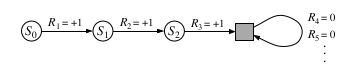
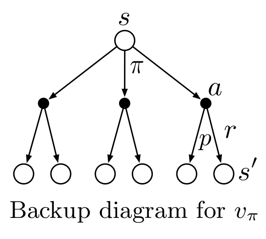

# Unified Notation for Episodic and Continuing Tasks

Episodic tasks requires some additional notation. Rather than one long sequence of time steps, we need to consider a series of episodes, each of which consists of a finite sequence of time steps. We have to refer not just to $S_t$ , the state representation at time $t$, but to $S_{t,i}$ , the state representation at time $t$ of episode $i$ (and similarly for $A_{t,i}$,
$R_{t,i}$, $\pi_{t,i}$, $T_{i}$ , etc.). 
> For simplicity we write $S_t$ to refer to $S_{t,i}$ , and so on.

To obtain a single notation that covers both episodic and continuing tasks. We have defined the return as a sum over a finite number of terms in one case and as a sum over an infinite number of terms in the other. These two can be unified by considering episode termination to be the entering of a special *absorbing state* that transitions only to itself and that generates only rewards of zero.

Here the solid square represents the special absorbing state corresponding to the end of an
episode. Starting from $S_0$ , we get the reward sequence $+1, +1, +1, 0, 0, 0, . . ..$ Summing
these, we get the same return whether we sum over the first $T$ rewards (here $T=3$) or
over the full infinite sequence. This remains true even if we introduce discounting.

$$G_t=\sum\limits_{k=t+1}^T\gamma^{k-t-1}R_k$$

We can write $G_t$ thereby including possibility that $T=\infty$ or $\gamma=1$ **(but not both)**.

---

# Policies and Value Functions

> Almost all reinforcement learning algorithms involve estimating value functions—functions of states (or of state–action pairs) that estimate how good it is for the agent to be in a given state (or how good it is to perform a given action in a given state). The notion of “how good” here is defined in terms of future rewards that can be expected, or, to be precise, in terms of expected return. Of course the rewards the agent can expect to receive in the future depend on what actions it will take. Accordingly, value functions are defined with respect to particular ways of acting, called policies.

---
### Policy
A *policy* is a mapping from states to probabilities of selecting each possible
action. If the agent is following policy $\pi$ at time $t$, then $\pi(a|s)$ is the probability that
$A_t = a$ if $S_t = s$. Like $p$, $\pi$ is an ordinary function; the “|” in the middle of $\pi(a|s)$ merely reminds that it defines a probability distribution over $a\in A(s)$ for each $s\in S$.
Reinforcement learning methods specify how the agent’s policy is changed as a result of
its experience.

---
# Value function
### State-value $v_\pi(s)$
The value function of a state $s$ under a policy $\pi$, denoted $v_\pi(s), is the expected return
when starting in $s$ and following $\pi$ thereafter. For MDPs, we can define $v_\pi$ formally by

$$\begin{aligned} v_\pi(s) =& \mathbb{E}_\pi[G_t|S_t=s]\\ =& \mathbb{E}_\pi \left[\left. \sum\limits_{k=0}^\infty \gamma^k R_{t+k+1\right | S_t=s\right] \end{aligned}$$
for all $s\in S$ where $\mathbb{E}_\pi[\cdot]$ denotes the expected value of a random variable given that the agent follows policy $\pi$, and $t$ is any time step.

> The value of the terminal state, if any, is always zero. 

We call the function $v_\pi$ the *state-value function* for policy $\pi$.

### Action-value $q_\pi(s,a)$

Similarly, we define the value of taking action $a$ in state $s$ under a policy $\pi$, denoted
$q_\pi(s, a)$, as the expected return starting from $s$, taking the action $a$, and thereafter
following policy $\pi$:

$$q_\pi(s,a) = \mathbb{E}_\pi[G_t|S_t=s,A_t=a] = \mathbb{E}_\pi \left[\left. \sum\limits_{k=0}^\infty\gamma^k R_{t+k+1\right| S_t=s,A_t=a\right]$$

We call $q_\pi$ the *action-value function* for policy $\pi$.

> The value functions $v_\pi$ and $q_\pi$ can be estimated from experience.

---
# Bellman Equation

A fundamental property of value functions used throughout reinforcement learning and dynamic programming is that they satisfy recursive relationships. 

For any policy $\pi$ and any state $s$, the following consistency condition holds between the value of s and the value of its possible successor states:

$$\begin{aligned} v_\pi(s) =& \mathbb{E}_\pi[G_t|S_t=s]\\
=& \mathbb{E}_\pi \left[\left. \sum\limits_{k=0}^\infty\gamma^k R_{t+k+1\right | S_t=s \right]\\
=& \sum\limits_a\pi(a|s)\sum\limits_{s'}\sum\limits_{a}p(s',r|s,a)\left[r+\gamma \mathbb{E}_\pi\left[ G_{t+1} | S_{t+1} = s' \right]\right]\\
=&\sum\limits_a\pi(a|s) \ sum\limits_{s',a} p(s',r|s,a) \left[r + \gamma v_\pi(s') \right], \text{for all} s\in S\end{aligned}$$

It is a sum over all values of the three variables, $a$, $s'$, and $r$. For each triple, we compute its probability, $\pi(a|s)p(s',r|s,a)$, weight the quantity in brackets by that probability, then sum over all possibilities to get an expected value.

The Bellman equation averages over all the possibilities, weighting each by its probability of occurring. It states that the value of the start state must equal the (discounted) value of the expected next state, plus the reward expected along the way.

---

# Backup diagram

Diagrams like that above are called *backup diagrams*, because they driagram relationships that form the basis of the update or *backup* operations that are at the heart of reinforcement learning methods. These operations transfer value information *back* to a state(or a state-action pair) from its successor states(or state-action pairs).

---

- Policy $\pi$ random, each action(left,right,top,bottom) equal probability $(0.25)$.
- Discounting factor $\gamma=0.9$.
- The values are computed by solving the system of linear equations (bellman equation at each state).
---
# References

- ["Reinforcement Learning: An Introduction", Richard S. Sutton and Andrew G. Barto, 2nd Edition.](https://inst.eecs.berkeley.edu/~cs188/sp20/assets/files/SuttonBartoIPRLBook2ndEd.pdf)

