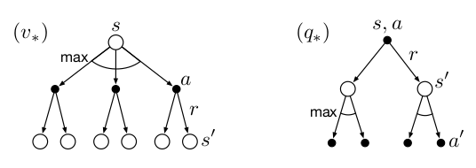
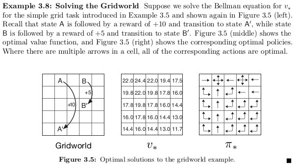

# Optimal Policies and Optimal Value Functions

A policy $\pi$ is defined to be better than or equal to a policy $\pi$ $\pi '$ if its expected return is greater than or equal to that of $\pi '$ for all states. In other words, $\pi\geq\pi '$ if and only if $v_\pi(s)\geq v_{\pi '}(s)$ for all $s \in S$. There is always at least one policy that is better than or equal to all other policies. This is an *optimal policy*.

We denote all the *optimal policies* by $\pi_*$. They share the same state-value function, called the *optimal state-value* function, denoted $v_*$, and defined as

$$v_*(s)=max\limits_\pi v_\pi(s)$$
for all $s \in \mathcal{S}$

Optimal policies also share the same optimal action-value function, denoted $q*$, and
defined as.
$$q*(s, a) = max\limits_\pi q_\pi(s, a)$$,
for all $s\in \mathcal{S}$ and $a\in A(s)$.

we can write $q*$ in terms of $v_*$ as follows:
$$q*(s, a) = \mathbb[R_{t+1} + \gamma v_*(S_{t+1} ) | S_t= s, A_t = a]$$

---

# Bellman optimality equation

Because $v_*$ is the value function for a policy, it must satisfy the self-consistency condition given by the Bellman equation for state values. Because it is the optimal value function, however, $v_*$’s consistency condition can be written in a special form without reference to any specific policy. This is the Bellman equation for $v_*$, or the *Bellman optimality equation*. 
> Intuitively, the Bellman optimality equation expresses the fact that the value of a state under an optimal policy must equal the expected return for the best action from that state:

$$
\begin{aligned}
v_*(s)=&max\limit_{a\in A(s)} q_{\pi_*}(s,a)\\
=&max\limit_{a}\mathbb{E}_{\pi_*}\left[G_t|S_t=a,A_t=a\right]\\
=&max\limit_{a}\mathbb{E}_{\pi_*}\left[R_{t+1}+\gamma G_{t+1}|S_t=a,A_t=a\right]\\
=&max\limit_{a}\mathbb{E}_{\pi_*}\left[R_{t+1}+\gamma v_*(S_{t+1})|S_t=a,A_t=a\right]\\
=&max\limit_{a}\sum\limits_{s',r}p(s',r|s,a)[r+\gamma v_*(s')]
\end{aligned}
$$

The last two equations are two forms of the *Bellman optimality equation* for $v_*$ . 

The Bellman optimality equation for $q_*$ is 

$$
\begin{aligned}
q_*(s,a)=&\mathbb{E}\left[R_{t+1}+\gamma max\limit_{a'}q_*(S_{t+1},a')|S_t=a,A_t=a\right]\\
=&\sum\limits_{s',r}p(s',r|s,a)[r+\gamma max\limit_{a'}q_*(S_{t+1},a')]
\end{aligned}
$$

---
# Backup diagrams
The backup diagrams in the figure below show graphically the spans of future states and actions considered in the Bellman optimality equations for $v_*$ and $q_*$ . These are the same as the backup diagrams for $v_\pi$ and $q_\pi$ presented earlier except that arcs have been added at the agent’s choice points to represent that the maximum over that choice is taken rather than the expected value given some policy. The backup diagram on the left graphically represents the Bellman optimality equation  and the backup diagram on the right graphically represents .

> For finite MDPs, the Bellman optimality equation for $v_*$  has a unique solution. The Bellman optimality equation is actually a system of equations, one for each state, so if there are $n$ states, then there are n equations in n unknowns. If the dynamics $p$ of the environment are known, then in principle one can solve this system of equations for $v_*$ using any one of a variety of methods for solving systems of nonlinear equations. One can solve a related set of equations for $q_*$.

Once one has $v_*$ , it is relatively easy to determine an optimal policy. For each states, there will be one or more actions at which the maximum is obtained in the Bellman optimality equation. Any policy that assigns nonzero probability only to these actions is an optimal policy.

---

---

---
# Solving the Bellman optimality equation

Explicitly solving the Bellman optimality equation provides one route to finding an
optimal policy, and thus to solving the reinforcement learning problem. **However, this
solution is rarely directly useful**. It is akin to an exhaustive search, looking ahead at
all possibilities, computing their probabilities of occurrence and their desirabilities in
terms of expected rewards. 

##### This solution relies on at least three assumptions that are rarely true in practice: 

1. We accurately know the dynamics of the environment;
1. We have enough computational resources to complete the computation of the solution; and 
1. the Markov property. 

> For example, although the first and third assumptions present no problems for the game of backgammon, the second is a major impediment. Because the game has about $10^20$ states, it would take thousands of years on today’s fastest computers to solve the Bellman equation for  $v_*$ , and the same is true for finding $q_*$ . 

**In reinforcement learning one typically has to settle for approximate solutions.**

# Therefore we need Dynamic Programming

---
# References

- ["Reinforcement Learning: An Introduction", Richard S. Sutton and Andrew G. Barto, 2nd Edition.](https://inst.eecs.berkeley.edu/~cs188/sp20/assets/files/SuttonBartoIPRLBook2ndEd.pdf)

