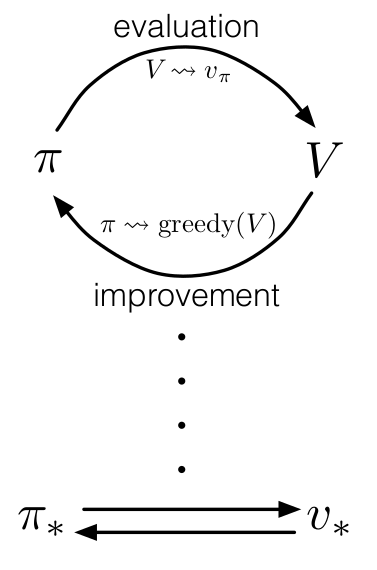
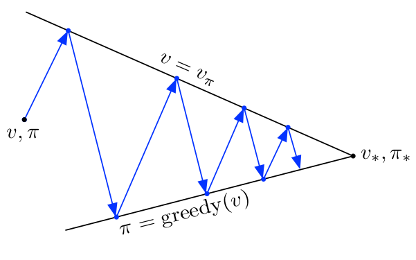

# Policy Improvement Theorem

The Policy Improvement Theorem is a fundamental result in reinforcement learning, particularly in the context of policy iteration methods. 

> The theorem states that if a policy \( \pi' \) is better than or equal to another policy \( \pi \) for all states and strictly better for at least one state, then the policy \( \pi' \) must be an improvement over \( \pi \).

Formally, the Policy Improvement Theorem can be stated as follows:

Let \( \pi \) and \( \pi' \) be two policies such that for all states \( s \) in the state space:

\[ Q_\pi(s, \pi'(s)) \geq V_\pi(s) \]

and for at least one state \( s \):

\[ Q_\pi(s, \pi'(s)) > V_\pi(s) \]

where \( Q_\pi(s, a) \) is the action-value function representing the expected cumulative reward starting from state \( s \), taking action \( a \), and then following policy \( \pi \), and \( V_\pi(s) \) is the value function for policy \( \pi \).

Then, the policy \( \pi' \) is an improvement over \( \pi \), denoted as \( V_{\pi'}(s) \geq V_\pi(s) \) for all states.

This theorem is the basis for policy iteration algorithms, where an initial policy is iteratively improved until an optimal policy is found. The algorithm alternates between policy evaluation (computing the value function for a policy) and policy improvement (selecting a better policy based on the current value function).

The intuition behind the theorem is that if \( \pi' \) is better than \( \pi \) for at least one state and not worse for any state, then adopting \( \pi' \) as the new policy will result in an overall improvement.

---
# Asynchronous Dynamic Programming
Asynchronous Dynamic Programming (ADP) is a variant of dynamic programming used in reinforcement learning, particularly in the context of *solving large-scale problems* with *large state or action spaces*. Dynamic programming methods, such as policy iteration and value iteration, are powerful techniques for solving Markov Decision Processes (MDPs), but they can be computationally expensive and memory-intensive, making them challenging to apply to real-world problems with large state spaces.

In *traditional dynamic programming*, the algorithm *iterates over all states or state-action pairs in a synchronous manner*. However, in Asynchronous Dynamic Programming, the updates are performed asynchronously, meaning that not all states or state-action pairs are updated in each iteration. Instead, a subset of states or state-action pairs is selected for update, and this selection can be done in various ways.

> The key idea behind ADP is to *update only a portion of the state or action space in each iteration, which can lead to more efficient computation and memory usage*. **This is particularly useful in scenarios where the state space is so large that it is impractical to update all states in a single iteration.**

#### Here are a few approaches to implement asynchronous updates in dynamic programming:

1. **In-Place Dynamic Programming:** Update the values of states directly without creating a new copy of the value function. This is in contrast to the traditional dynamic programming methods that create a new copy of the value function in each iteration.

2. **Prioritized Sweeping:** Focus updates on states that are most likely to lead to significant changes in the value function. This can be based on the magnitude of prediction errors or other criteria.

3. **Real-Time Dynamic Programming:** Update values of states as they are encountered during the agent's experience rather than in separate iterations.

###### Asynchronous Dynamic Programming is often used in combination with function approximation techniques, such as tile coding or neural networks, to handle large state spaces more effectively. The asynchronous nature allows the algorithm to scale better to problems with high-dimensional or continuous state spaces.

---
# Generalized Policy Iteration

Generalized Policy Iteration (GPI) is a framework in reinforcement learning that *unifies various approaches to policy and value iteration*. It provides a general framework for combining and interchanging the key components of *policy evaluation, policy improvement, and exploration*. The idea behind GPI is to iterate between these components in a way that gradually improves both the policy and the value function.

### The two main components of Generalized Policy Iteration are:

#### 1. **Policy Evaluation:**
- In policy evaluation, the goal is to estimate the value function (or action-value function) for a given policy.
- This is typically done using iterative methods such as dynamic programming or Monte Carlo methods to approximate the expected cumulative reward for each state (or state-action pair) under the current policy.

#### 2. **Policy Improvement:**
- In policy improvement, the goal is to improve the current policy based on the current estimate of the value function.
- This can be done by selecting actions that are expected to yield higher rewards according to the current value function, effectively making the policy more greedy with respect to the value function.

The iterations between policy evaluation and policy improvement create a feedback loop, and this process is repeated until a convergence criterion is met or a satisfactory policy is found.

It provides a conceptual bridge between different reinforcement learning algorithms, emphasizing the key *commonality of iteratively improving both policies and value functions*.

In summary, Generalized Policy Iteration is a versatile framework that abstracts the core components of reinforcement learning algorithms, providing a unified perspective on how policies and value functions can be iteratively refined to approach an optimal solution.

---
# Assignment 
- State and prove policy evaluation theorem.
- Write and explain pseudocode (or algorithm) for policy iteration.
- Write and explain pseudocode (or algorithm) for value iteration.
- Explain Example 4.2 from the reference book.

---
# References

- ["Reinforcement Learning: An Introduction", Richard S. Sutton and Andrew G. Barto, 2nd Edition.](https://inst.eecs.berkeley.edu/~cs188/sp20/assets/files/SuttonBartoIPRLBook2ndEd.pdf)

- [Model Based Planning using Dynamic Programming](https://www.analyticsvidhya.com/blog/2018/09/reinforcement-learning-model-based-planning-dynamic-programming/)

- [Grid World Demo](https://cs.stanford.edu/people/karpathy/reinforcejs/gridworld_dp.html)

