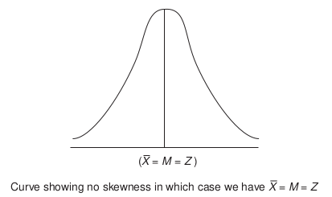

# Discriptive Statistics

#### Measure of Central Tendency
#### Measure of Dispersion
#### Measure of Skewness
#### kurtosis and covariance

---
Measures of central tendency are statistical measures that describe the center or average of a set of data. The three main measures of central tendency are the **mean, median, and mode**. 

1. **Mean:**
   - The mean, often referred to as the average, is calculated by summing up all the values in a data set and then dividing by the number of values.
   - Formula: \[ \text{Mean} (\bar{x}) = \frac{\sum_{i=1}^{n} x_i}{n} \]
     - Where \(\bar{x}\) is the mean, \(x_i\) is each individual value, and \(n\) is the number of values.

2. **Median:**
   - The median is the middle value in a sorted, ascending, or descending list of numbers. If there is an even number of observations, the median is the average of the two middle values.
   - Formula (for odd \(n\)): \[ \text{Median} = \text{Middle Value} \]
   - Formula (for even \(n\)): \[ \text{Median} = \frac{\text{Value at Position} \left(\frac{n}{2}\right) + \text{Value at Position} \left(\frac{n}{2} + 1\right)}{2} \]

3. **Mode:**
   - The mode is the value that appears most frequently in a data set. A data set may have one mode, more than one mode, or no mode at all.
   - Formula: Mode is often denoted as \(\text{Mode} = \text{Most Common Value(s)}\).

**Categorical data** consists of categories or labels and cannot be measured in numerical terms. The mode is particularly useful for describing the central tendency of categorical data. Here's an example to illustrate this:

**Example: Favorite Colors**

Suppose you conduct a survey to find out the favorite colors of a group of people. The data you collect might look like this:

- Person 1: Blue
- Person 2: Red
- Person 3: Green
- Person 4: Blue
- Person 5: Red
- Person 6: Blue
- Person 7: Green
- Person 8: Blue

In this case, the data is categorical because it consists of categories (colors) rather than numerical values. To find the mode, you look for the color that appears most frequently in the data.

These measures help to summarize and describe the center of a distribution. The choice of which measure to use depends on the characteristics of the data. 
> The mean is sensitive to extreme values, while the median is less affected by outliers. 
> The mode is particularly useful for categorical data.

---
# Measures of dispersion
Also known as **measures of variability or spread**, quantify the extent to which individual data points in a dataset differ from the central tendency (mean, median, or mode). Common measures of dispersion include the *range, variance, standard deviation, and interquartile range*. 

1. **Range:**
   - **Definition:** The range is the difference between the maximum and minimum values in a dataset.
   - **Formula:** \[ \text{Range} = \text{Max} - \text{Min} \]
   - **Use:** The range provides a simple measure of the spread in the data. It is easy to calculate but can be sensitive to outliers.

2. **Variance:**
   - **Definition:** Variance is the average of the squared differences between each data point and the mean.
   - **Formula:** \[ \text{Variance} (\sigma^2) = \frac{\sum_{i=1}^{n} (x_i - \bar{x})^2}{n} \]
   - **Use:** Variance quantifies the overall variability in the dataset. It is sensitive to outliers and provides a more comprehensive measure of spread than the range.

3. **Standard Deviation:**
   - **Definition:** The standard deviation is the square root of the variance.
   - **Formula:** \[ \text{Standard Deviation} (\sigma) = \sqrt{\text{Variance}} \]
   - **Use:** Like variance, the standard deviation measures the average deviation of data points from the mean. It is widely used due to its easy interpretation and is less sensitive to outliers than variance.

4. **Interquartile Range (IQR):**
   - **Definition:** The IQR is the range between the first quartile (Q1) and the third quartile (Q3) of a dataset.
   - **Formula:** \[ \text{IQR} = Q3 - Q1 \]
   - **Use:** The IQR is resistant to outliers and provides a measure of the spread of the middle 50% of the data. It is useful when the dataset is skewed or contains outliers.

**When to Use Measures of Dispersion:**
- **Understanding Spread:** Measures of dispersion help you understand how spread out or concentrated your data is. A small dispersion indicates that data points are close to the central value, while a large dispersion suggests greater variability.
  
- **Comparison:** When comparing two or more datasets, measures of dispersion can indicate which dataset has more variability. For example, if you are comparing the performance of two products, knowing the spread of customer ratings can be informative.

- **Identifying Outliers:** Measures of dispersion can help identify outliers or extreme values in a dataset. Outliers can significantly affect measures of central tendency, and understanding the spread helps in interpreting their impact.

- **Decision Making:** In various fields, such as finance or quality control, understanding the spread of data is crucial for decision-making. For instance, in financial analysis, knowing the volatility (a form of dispersion) of stock prices is important for risk assessment.

The measures of dispersion are essential for providing insights into the variability of data. They complement measures of central tendency and contribute to a more comprehensive understanding of the characteristics of a dataset.

---
# Measure of Skewness
Skewness is, thus, a measure of asymmetry and shows the manner in which the items are clustered
around the average.

In case of positive skewness, we have $Z < M < X$ and in case of negative skewness we have $X < M < Z$. here $Z$ is mode, $M$ is Median, and $\overline{X}$ is mean
Usually we measure skewness in this way:

$$ S_k=\frac{\overline{X}-Z}{\sigma}$$

in case $Z$ is ill-defined or not defined

$$ S_k=\frac{3\overline{X}-M}{\sigma}$$

---
# Measure of relationship: covariance and correlation

Covariance and correlation are measures that describe the relationship between two variables in a dataset. They both quantify the extent to which the variables change together.

1. **Covariance:**
   - **Definition:** Covariance measures the degree to which two variables vary together. It indicates the direction of the linear relationship between the variables.
   - **Formula:** 
     \[ \text{Cov}(X, Y) = \frac{\sum_{i=1}^{n} (X_i - \bar{X})(Y_i - \bar{Y})}{n} \]
     Where \(X_i\) and \(Y_i\) are individual data points, \(\bar{X}\) and \(\bar{Y}\) are the means of \(X\) and \(Y\), and \(n\) is the number of data points.
   - **Interpretation:** 
     - Positive covariance indicates a direct relationship (both variables increase or decrease together).
     - Negative covariance indicates an inverse relationship (one variable increases as the other decreases).
     - However, the magnitude of covariance is not standardized, making it difficult to compare across datasets.

2. **Correlation:**
   - **Definition:** Correlation is a standardized measure of the strength and direction of a linear relationship between two variables. It scales the covariance by the standard deviations of the variables.
   - **Formula:** 
     \[ \text{Corr}(X, Y) = \frac{\text{Cov}(X, Y)}{\sigma_X \cdot \sigma_Y} \]
     Where \(\sigma_X\) and \(\sigma_Y\) are the standard deviations of \(X\) and \(Y\).
   - **Range:** Correlation values range from -1 to 1.
     - \( \text{Corr} = 1 \): Perfect positive correlation
     - \( \text{Corr} = -1 \): Perfect negative correlation
     - \( \text{Corr} = 0 \): No linear correlation
   - **Interpretation:** The correlation coefficient provides a standardized measure that allows for easier comparison across datasets.

### When to Use:
- **Covariance:** Use covariance when you want to understand the direction of the relationship between two variables but don't need a standardized measure. However, keep in mind that the magnitude of covariance is not easily interpretable.
  
- **Correlation:** Use correlation when you want a standardized measure that is comparable across datasets. Correlation is widely used because it provides a clear indication of the strength and direction of a linear relationship.

---

# Reference

1. [Ch 8 Research Methodology by C R Kothari](https://www.academia.edu/43821533/Research_Methodology_by_C_R_Kothari)
1. [Ranjit Kumar Research Methodology A Step by Step Guide for Beginers](https://www.academia.edu/33999877/Ranjit_Kumar_Research_Methodology_A_Step_by_Step_G)

