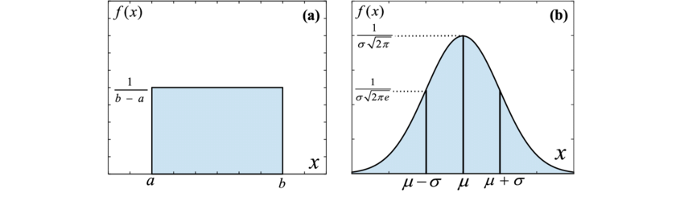
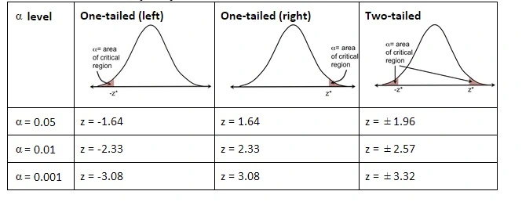

# Pouplation ($N,\mu,\sigma$) and Sample ($n,\bar{X},S$)

> To remember while calculating deviation 'S' in case of $n$ *Samples* numerator is $n-1$

1. **$\mu$ (Mu) and $\bar{X}$ (x-bar):**

- $\mu$ (Mu) represents the population mean. It is the average of all values in a population. The formula for the population mean is:

     \[
     \mu = \frac{\sum_{i=1}^{N} X_i}{N}
     \]

     where \(N\) is the population size and \(X_i\) are individual values in the population.

- $\bar{X}$ (x-bar) represents the sample mean. It is the average of all values in a sample. The formula for the sample mean is:

     \[
     \bar{X} = \frac{\sum_{i=1}^{n} x_i}{n}
     \]

     where \(n\) is the sample size and \(x_i\) are individual values in the sample.

2. **$S$ and $\sigma$ (Sigma):**
- $\sigma$ (Sigma) represents the population standard deviation. It is similar to the sample standard deviation but is calculated for an entire population. The formula for the population standard deviation is:

     \[
     \sigma = \sqrt{\frac{\sum_{i=1}^{N} (X_i - \mu)^2}{N}}
     \]

     where \(N\) is the population size, \(X_i\) are individual values in the population, and \(\mu\) is the population mean.

- $S$ represents the sample standard deviation. It is a measure of the amount of variation or dispersion in a set of values. The formula for the sample standard deviation is:

     \[
     S = \sqrt{\frac{\sum_{i=1}^{n} (x_i - \bar{X})^2}{n-1}}
     \]

     where \(n\) is the sample size, \(x_i\) are individual values in the sample, and \(\bar{X}\) is the sample mean.

---

**Population:**
- \(N\) represents the size of the population.
- \(\mu\) (Mu) represents the population mean.
- \(\sigma\) (Sigma) represents the population standard deviation.

**Sample:**
- \(n\) represents the size of the sample.
- \(\bar{X}\) (x-bar) represents the sample mean.
- \(S\) represents the sample standard deviation.

When calculating the sample standard deviation (\(S\)), you divide by \(n-1\) (degrees of freedom equal to the sample size minus 1) instead of \(n\) to provide an unbiased estimate of the population standard deviation. This adjustment is known as *Bessel's correction* and corrects for the fact that you are using the sample mean (\(\bar{X}\) ) instead of the true population mean (\(\mu\)) in the calculations. The formula for the sample standard deviation is:
$$S = \sqrt{\frac{\sum_{i=1}^{n} (x_i - \bar{X})^2}{n-1}}$$
This correction helps to *account for the fact that using the sample mean introduces some uncertainty*, and it provides a more accurate estimate of the population standard deviation.

---
# Probability Density Function (PDF) 
In probability theory and statistics, a Probability Density Function (PDF) is a function that describes the likelihood of a continuous random variable taking on a particular value. The PDF is a fundamental concept used to characterize and analyze probability distributions.

### Properties of PDFs:
- The probability that a continuous random variable falls within a specific interval is given by the integral of the PDF over that interval.
- The total area under the PDF curve over the entire range is equal to 1.

### Notation:
- The PDF is often denoted by \(f(x)\), where \(x\) is the variable of interest.
- Mathematically, the probability of \(X\) falling in the interval \((a, b)\) is given by the integral of \(f(x)\) over that interval:
     \[ P(a < X < b) = \int_{a}^{b} f(x) \,dx \]
### Interpretation:
- While the PDF gives the probability density at each point, it does not give the probability of a specific point. Instead, the probability is associated with intervals.
---
### Example:
##### Uniform Distribution:
For a continuous uniform distribution between \(a\) and \(b\), the PDF is constant within the interval \((a, b)\), and zero outside that interval. The PDF is given by:

     \[ f(x) = \frac{1}{b - a} \text{ for } a < x < b \]

     In this case, the total area under the curve is 1.

##### Normal Distribution:
The normal distribution, also known as the *Gaussian distribution* or bell curve, is a specific type of probability distribution. It is characterized by a symmetric bell-shaped curve and is fully defined by two parameters: the mean (\(\mu\)) and the standard deviation (\(\sigma\)). The PDF of the normal distribution is given by the formula:

  \[ f(x) = \frac{1}{\sigma \sqrt{2\pi}} \exp\left(-\frac{(x - \mu)^2}{2\sigma^2}\right) \]

  This formula describes the likelihood of a random variable taking on a specific value \(x\) in a normal distribution.

In summary, when you refer to the "PDF," you are talking about a general concept applicable to various probability distributions. 

---
# Z-value
- $\mu\pm1\sigma$ includes $68.27%$
- $\mu\pm2\sigma$ includes $95.45%$
- $\mu\pm3\sigma$ includes $99.73%$

z-value of any sample $X$ is defined as
$$ z=\frac{X-\mu}{\sigma} $$

# Level of significance ($\alpha$)
($\alpha$) is the probability of type I error (H0 is true, but H0 is rejected).
- It is usually 5% or 0.05
- It implies that h0 will be rejected when the sample result (observed evidence) has a less than 0.05 probability of occuring if H0 is true.
- It means a resercher is willing to take as much as a 5% risk of rejecting the null hypothesis when it (H0) is true.
- Also it must be determined in advance (before sample results are obtained).

---
# Two tail and one tail test
Three types of hypothesis testing cases:
## 1
$H_0: \mu=\mu_0$ against $H_1: \mu\neq\mu_0$
## 2
$H_0: \mu\leq\mu_0$ against $H_1: \mu>\mu_0$
## 3
$H_0: \mu\geq\mu_0$ against $H_1: \mu<\mu_0$

> Based on the sign used in defining H1 we have three different test.
- $\neq$ : two tail test
- $>$ : right tail test
- $<$ : left tail test

---
# Example:
#### We want to examine that the mean age of population in a city is 40 years. 
In order to conduct this hypothesis testing we need to be a bit more specific to examine.

1. The mean age of the population in the city is 40 years or not, *or*
1. The mean age of the population in the city is 40 years or higher, *or*
1. The mean age of the population in the city is 40 years or lower.

These three claims (statements) can be used to setup the hypothesis which are given by:

1. $H_0:\mu=40$ Against $H_1:\mu\neq40$ for claim 1,
1. $H_0:\mu\geq40$ Against $H_1:\mu>40$ for claim 2,
1. $H_0:\mu\leq40$ Against $H_1:\mu<40$ for claim 3, 

> If experimental mean of samples is 20 years. It is significantly lower than 40, and **if H0 is true then the probability of getting such a different mean would be very small.** or sample mean of 20 is very unlikely. 

## So, can we reject H0 ?

- How far is *"far enough"* to reject H0.

There comes a critical value to be decided.
---
# Critical value and Critical region

Critical value divides the area under the probability curve of distribution of test statistics in to two regions.

1. Critical (or rejection) region
1. Acceptance region

The size of critical region is given by level of significance ($\alpha$) and size of acceptance region is ($1-\alpha$)

> If the value of test statistics falls into critical region h0 is rejected.

---
Testing is done on sampled observation (n).
if $n$ is large (n>30) then distribution of test becomes normal distribution then usually z-test can be used, if $n$ is small ($n<=30$) then other distributions are used like t-dist., F-dist. and chi squre dist. (t-test can be used if $n<=30$)

The choice between a Z-test and a t-test depends on the characteristics of the data and the context of your analysis. Here are the general conditions for each test:

**Z-Test:**
1. **Known Population Standard Deviation (\(\sigma\)):** The Z-test is appropriate when you know the population standard deviation. This situation is relatively rare in practice, as the population standard deviation is often unknown.

2. **Large Sample Size:** The Z-test becomes more reliable as the sample size increases. A rule of thumb is to use the Z-test when the sample size (\(n\)) is greater than 30. This is based on the Central Limit Theorem, which states that the distribution of the sample mean approaches a normal distribution as the sample size increases.

**T-Test:**
1. **Unknown Population Standard Deviation (\(\sigma\)):** When the population standard deviation is unknown, the t-test is more appropriate. In practice, if you're dealing with sample data and don't know the population standard deviation, you would typically use a t-test.

2. **Small Sample Size:** The t-test is robust for smaller sample sizes (typically when \(n\) is less than 30). It is less sensitive to the size of the sample compared to the Z-test. For very small sample sizes (e.g., less than 15), the t-test is often preferred.

In summary, if you know the population standard deviation and have a sufficiently large sample size, you might use a Z-test. If the population standard deviation is unknown or if you have a smaller sample size, a t-test is more appropriate. It's essential to consider both the characteristics of your data and the assumptions of each test when choosing between a Z-test and a t-test.

---
# Z-test
A Z-test is a statistical method used to determine if there is a significant difference between sample and population means or between the means of two samples. It's named after the standard normal distribution, often denoted as Z, which is used in the test.

The formula for a Z-test depends on the context, but in general, it involves calculating a Z-score:

\[ Z = \frac{{\bar{X} - \mu}}{{\sigma/\sqrt{n}}} \]

Here:
- \(\bar{X}\) is the sample mean.
- \(\mu\) is the population mean.
- \(\sigma\) is the population standard deviation.
- \(n\) is the sample size.

The resulting Z-score is then compared to critical values or used to calculate a p-value to determine the statistical significance of the difference.

> The Z-test assumes that the population distribution is normal or that the sample size is sufficiently large for the Central Limit Theorem to apply.

---
# Question 
In a sample of 1000 people in a state. 540 are rice eaters and the rest are wheat eaters. can we assume that both rice and wheat are equally popular in this state at a 1% level of significance? 

### Sol:
To test whether rice and wheat are equally popular in the state, you can perform a hypothesis test for proportions. Let's denote:

- \(p_1\) as the proportion of rice eaters in the population.
- \(p_2\) as the proportion of wheat eaters in the population.

The null hypothesis (\(H_0\)) and the alternative hypothesis (\(H_a\)) can be set up as follows:

\[ H_0: p_1 = p_2 \]
\[ H_a: p_1 \neq p_2 \]

You want to test whether there is a significant difference in the proportions of rice and wheat eaters.

Now, given that you have a sample of 1000 people, and 540 of them are rice eaters, you can calculate the sample proportion \( \bar{X}_1 \):

\[ \bar{X}_1 = \frac{\text{Number of rice eaters}}{\text{Total sample size}} = \frac{540}{1000} = 0.54 \]

The sample proportion \( \mu_0 \) for wheat eaters would be \(1 - \bar{X}_1\), since the rest are wheat eaters:

\[ \mu_0 = 1 - \bar{X}_1 = 1 - 0.54 = 0.46 \]

Next, you need to perform a hypothesis test, such as a z-test for proportions. The test statistic can be calculated as:

\[ Z = \frac{(\bar{X}_1 - \mu_0)}{\sqrt{\mu_0(1-\mu_0)\left(\frac{1}{n}\right)}} =\frac{0.54-0.5}{\sqrt{\frac{0.5\times(1-0.5)}{1000}}} = 2.532\]

where \(\bar{X}\) is the pooled sample proportion, 
*SE standard error of the sample proportion*
($SE =\frac{\sigma}{\sqrt{n}}$) or
($SE =\sqrt{\frac{\mu_0\times(1-\mu_0)}{n}}$)

### z-table for p-value
* check your p-value from [z-score table](https://www.sjsu.edu/faculty/gerstman/EpiInfo/z-table.htm)
0.9943 

so p value can be interpreted as 1-0.9943 = 0.0057

this p value is less than $\alpha=0.01$ or it falls in critical or rejection region. therefore H0 is rejected and H1 is accepted.

If the absolute value of the test statistic is greater than the critical value for a two-tailed test at a 1% level of significance, you would reject the null hypothesis.
> Therefore, there is evidence to suggest that rice and wheat are not equally popular in the state.

---
# Question
User
A dice is thrown 9000 times and a 3 or 4 is observed 3240 times. show that the dice cannot be regarded as an unbiased one and find the limits between the probability of a throw 3  or 4. ?

### Sol:
H0: dice is unbiased
H1: Dice is biased

To test whether the dice is biased or unbiased, you can perform a hypothesis test for a binomial distribution. Let's denote:

- \( p \) as the probability of getting a 3 or 4 on a single throw (assuming the dice is unbiased).
- \( n \) as the number of trials (throws of the dice).
- \( x \) as the number of successes (getting a 3 or 4) in those trials.

The null hypothesis (\( H_0 \)) and the alternative hypothesis (\( H_a \)) can be set up as follows:

\[ H_0: p = \frac{1}{3} \]
\[ H_a: p \neq \frac{1}{3} \]

where \( \frac{1}{3} \) represents the assumed probability of getting a 3 or 4 on a single throw of an unbiased die.

Given that the dice is thrown 9000 times and a 3 or 4 is observed 3240 times, you can calculate the sample proportion \( \bar{X} \) as:

\[ \bar{X} = \frac{x}{n} = \frac{3240}{9000} \]

Next, you need to perform a hypothesis test, such as a z-test for proportions. The test statistic can be calculated as:

\[ Z = \frac{(\bar{X} - p_0)}{\sqrt{\frac{p_0(1-p_0)}{n}}} \]

where \( p_0 \) is the assumed probability under the null hypothesis.

In this case, \( p_0 = \frac{1}{3} \). The standard error of the sample proportion (\( SE(\bar{X}) \)) is given by:

\[ SE(\bar{X}) = \sqrt{\frac{p_0(1-p_0)}{n}} \]

You can then calculate the z-value and compare it to the critical values for a two-tailed test at the desired level of significance (e.g., 5%).

If the absolute value of the test statistic is greater than the critical value, you would reject the null hypothesis. If it's not, you would fail to reject the null hypothesis.

Now, let's perform the calculations:

\[ \bar{X} = \frac{3240}{9000} \]

\[ SE(\bar{X}) = \sqrt{\frac{\frac{1}{3} \times \left(1-\frac{1}{3}\right)}{9000}} \]

\[ Z = \frac{\left(\frac{3240}{9000} - \frac{1}{3}\right)}{\sqrt{\frac{\frac{1}{3} \times \left(1-\frac{1}{3}\right)}{9000}}} \]

# Assignment
After calculating the \( Z \)-value, you can compare it to critical values from the standard normal distribution to make a decision about the null hypothesis.

---
# References

1. [https://www.sciencedirect.com/topics/mathematics/tailed-test](https://www.sciencedirect.com/topics/mathematics/tailed-test)

